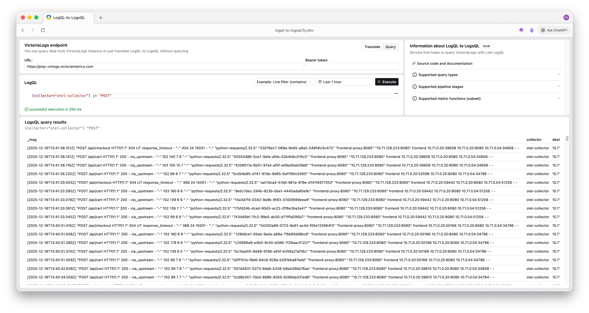

[](https://github.com/VictoriaMetrics-Community/logql-to-logsql/releases)


# logql-to-logsql

Web application that provides a simple proof-of-concept UI for querying [VictoriaLogs](https://docs.victoriametrics.com/victorialogs/) or [VictoriaTraces](https://docs.victoriametrics.com/victoriatraces/) data with [Loki LogQL](https://grafana.com/docs/loki/latest/query/).

It translates [Loki LogQL](https://grafana.com/docs/loki/latest/query/) queries to [VictoriaLogs LogsQL](https://docs.victoriametrics.com/victorialogs/logsql/),
optionally executes the translated query against a [VictoriaLogs](https://docs.victoriametrics.com/victorialogs/) or [VictoriaTraces](https://docs.victoriametrics.com/victoriatraces/) endpoints.

[](https://play-logql.victoriametrics.com)

## Highlights

- Go app + library
- AGPL license because the official LogQL parser is used as a dependency, which is licensed under AGPL
- Simple [Web UI](#web-ui) featuring LogQL editing, example gallery, and query results rendering.
- Simple [REST API](#rest-api) (`/api/v1/logql-to-logsql`) that you can call from scripts, CI, or other services.

## Quick start

### Try without installation

You can try the live demo on **[play-logql.victoriametrics.com](https://play-logql.victoriametrics.com)**

### Use binaries

Just download the latest release from [Releases](https://github.com/VictoriaMetrics-Community/logql-to-logsql/releases) page and run it.

### Run Docker image

You can run **logql-to-logsql** using Docker.
This is the easiest way to get started without needing to install Go or build from source:

```bash
docker run -d --name logql-to-logsql -p 8080:8080 -v /data/views \
  ghcr.io/victoriametrics-community/logql-to-logsql:latest
```

Here is the example with specified [config file](#configuration):

```bash
cat > config.json << EOL
{
  "listenAddr": ":8080",
  "endpoint": "https://play-vmlogs.victoriametrics.com",
  "bearerToken": ""
}
EOL

docker run -d --name logql-to-logsql -p 8080:8080 \
  -v /home/logql-to-logsql/data/views \
  -v ./config.json:/home/logql-to-logsql/config.json:ro \
  ghcr.io/victoriametrics-community/logql-to-logsql:latest \
  --config=config.json
```

### Run locally with Go

1. Install Go 1.25+, Node.js 24+, and npm.
2. Run the command (defaults to `:8080`):
   ```bash
   make run
   ```
   `make run` compiles the frontend (`npm install && npm run build`) and then executes `go run ./cmd/logql-to-logsql`.
3. Verify the service:
   ```bash
   curl http://localhost:8080/healthz
   # {"status":"ok"}
   ```
4. Open <http://localhost:8080> to use the web UI.

You can skip the UI rebuild if the embedded bundle already exists:
```bash
go run ./cmd/logql-to-logsql
```

### Use Docker (build from sources)

Build and run the containerised service (no Node.js required on the host):

```bash
docker build -t logql-to-logsql .
docker run -d -p 8080:8080 -v /data/views logql-to-logsql
```

## Configuration

The binary accepts an optional JSON configuration file with the `-config` flag:
```bash
logql-to-logsql -config ./config.json
```

Example (`config.json`):
```json
{
  "listenAddr": ":8080",
  "endpoint": "https://play-vmlogs.victoriametrics.com",
  "bearerToken": "<VM_BEARER_TOKEN>",
  "limit": 1000
}
```

| Field         | Type              | Description                                                                                                             | Default           |
|---------------|-------------------|-------------------------------------------------------------------------------------------------------------------------|-------------------|
| `listenAddr`  | string            | Address the HTTP server binds to.                                                                                       | `:8080`           |
| `endpoint`    | string            | VictoriaLogs base URL. Can be left empty (in this case you can specify it in UI or translate without executing queries) | empty             |
| `bearerToken` | string            | Optional bearer token injected into VictoriaLogs requests when `endpoint` is set.                                       | empty             |
| `limit`       | int               | Maximum number of rows returned by any query.                                                                           | 1000              |

Please note that VictoriaLogs is called via the backend, so if you are using logql-to-logsql in Docker, localhost refers to the localhost of the container, not your computer.

## REST API

All JSON responses include either a translated `logsql` statement, optional `data` payload (raw VictoriaLogs response or newline-delimited JSON), or an `error` message.
Security headers (`X-Content-Type-Options`, `X-Frame-Options`, `X-XSS-Protection`) are set on every response.

### `POST /api/v1/logql-to-logsql`

Translate (and optionally execute) a SQL statement.

Request body:
```json
{
  "logql": "<query>",
  "endpoint": "https://victoria-logs.example.com",
  "execMode": "translate|query",
  "bearerToken": "...",
  "start": "...", 
  "end": "..."
}
```

Successful response:

```json
{
  "logsql": "<translated>",
  "data": "<optional raw response>",
  "error": "<optional>"
}
```

Errors emit `HTTP 4xx/5xx` with `{ "error": "..." }`.

### `GET /api/v1/config`

Returns the endpoint and max rows limit configured on the server (used by the UI to decide whether the endpoint fields should be read-only):

```json
{ 
  "endpoint": "https://victoria-logs.example.com", 
  "limit": 1000 
}
```

### `GET /healthz`

Simple health endpoint returning `{ "status": "ok" }`.

### Static UI

`GET /` and any unrecognised path serves the embedded web bundle (`cmd/logql-to-logsql/web/dist`). Assets are cached in memory on first access.


## Web UI

Key features:

- **LogQL editor** with syntax highlighting, keyword completions, example gallery (`examples.ts`), and keyboard shortcuts (`Shift/Ctrl/Cmd + Enter`).
- **Endpoint panel** to toggle VictoriaLogs execution, edit URL/token, or switch to translation-only mode. If the server was booted with a fixed endpoint, fields are prefilled and locked.
- **Result viewer** rendering newline-delimited JSON into a table when VictoriaLogs is queried, or showing the translated LogsQL when running offline.
- **Docs sidebar** explaining supported SQL syntax.

## Contributing

Contributions are welcome. Please:
- Read and follow the [Code of Conduct](CODE_OF_CONDUCT.md).
- Run `make all` before submitting a PR.
- Ensure new features include translation tests under `lib/logsql` and, when relevant, API tests under `cmd/logql-to-logsql/api`.

## License

Licensed under the [GNU Affero General Public License, Version 3](LICENSE).
